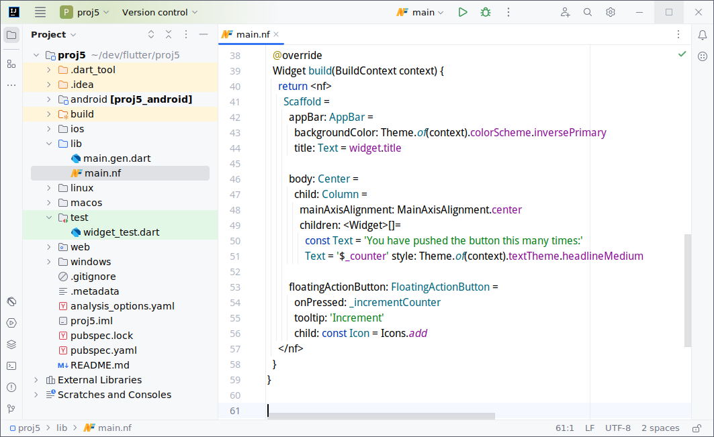
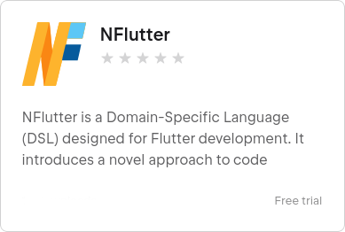

# NFlutter Documentation



[](https://plugins.jetbrains.com/plugin/23765-nflutter)

## Introduction

<b>NFlutter</b> is a Code Generation Domain-Specific Language (DSL) tailored specifically for Flutter development. It
transforms NFlutter DSL files into regular Dart code in a **gen.dart** file. This approach enables developers to write
in a
more concise syntax while still producing standard Dart code that is executable by Flutter.

NFlutter is inspired by F#, YAML and other indentation-based languages, it simplifies Flutter/Dart syntax by replacing
brackets and commas with more intuitive alternatives reducing syntactical clutter.

### The N in NFlutter

Initially, NFlutter stood for ‘No brackets, No commas’, or ‘No distractions’, emphasizing its goal to eliminate
syntactical clutter. However, over time, it has come to represent ‘Neat Flutter’, reflecting its effectiveness in
creating neat and clean code.

### Key Features

- **Fluent, Clutter-Free Syntax:** A streamlined approach to coding that reduces the need for excessive syntactical
  elements.

- **Dual-Language Support:** Offers seamless integration with the standard Dart language.

- **Easy Widget Editing:** Simplifies the process of editing widgets in Flutter.

- **No Vendor Lock:** NFlutter generates regular Dart source files, ensuring compatibility and flexibility.

- **Generated Code Preview Panel:** Allows developers to view the Dart code generated from NFlutter DSL in real-time.


## Quick Start

### Requirements

- IntelliJ IDE with the Dart plugin installed.

- Flutter SDK installed on your system.

### Installation Steps

- Open IntelliJ IDEA.

- Navigate to the IntelliJ Marketplace by selecting <b>`Menu > File > Settings > Plugins > Marketplace`</b> **.**

- Search for **"NFlutter"** and install the plugin.

- Alternatively, visit[ ](https://plugins.jetbrains.com/)[IntelliJ Plugins Marketplace](https://plugins.jetbrains.com/)
  online and search for **NFlutter**.

### Creating NFlutter File

To start using NFlutter in your project:

1. In IntelliJ IDEA, navigate to <b>`Menu > File > New`.</b>

2. Select "NFlutter File" (or use the shortcut <b>`Ctrl+Alt+N`).</b>

3. Name your file with a `.nf` extension (e.g., <b>`simple.nf`</b>).

By following these steps, you'll have the necessary environment set up to begin developing with NFlutter. The `.nf`
files you create will allow you to write Flutter code using the NFlutter DSL, which will be automatically transpiled
into Dart code.

## Hello World in NFlutter

This will demonstrate how NFlutter simplifies the Flutter code while maintaining the same functionality.

1. **Create a New NFlutter File:**

    - In IntelliJ IDEA, create a new file named **`simple.nf`**

2. **Write the NFlutter Code:**

    - Write the following NFlutter code into **`simple.nf`**:

```dart
import 'package:flutter/material.dart';

class Simple extends StatelessWidget {
  @override
  Widget build(BuildContext context) {
    return <nf>
      Column =
        children: []=
          Text = 'This is NFlutter' maxLines: 2
          Text = 'Hello World'
    </nf>
  }
}
```

#### &nbsp;&nbsp;&nbsp;&nbsp; Understanding the Code

- **Import Statement:** Just like in Dart, we start with importing necessary packages.

- **Simple Widget:** We define a `StatelessWidget` named `Simple`.

- **NFlutter Syntax:** Inside the `build` method, the `<nf>` tag indicates the start of NFlutter DSL.


3. **Save and Generate Dart code:**

- When you save the **simple.nf file**, NFlutter automatically generates the corresponding Dart code in a
  simple.gen.dart file.

- This Dart file contains the standard Flutter code equivalent to your NFlutter code, which you can run in your Flutter
  environment.

4. **Open the Preview Pane**

NFlutter also includes a handy Preview Pane feature to visualize the Dart code generated from your NFlutter code.

- To open the NFlutter Preview Pane, go to **`Menu > View > Tool Windows > NFlutter Preview`**

- This tool window will display the Dart code that corresponds to your NFlutter file.

##

## NFlutter Grammar

Understanding the grammar of NFlutter is key to effectively using the DSL. The primary component of this grammar is
the `<nf></nf>` **Tag**.

### 1. `<nf></nf>` Tag

- Marks the start and end of an NFlutter DSL code section.

- The code written within** **`<nf></nf>` is automatically transpiled into Dart code. By default, a semicolon is emitted
  at the end of the transpiled Dart code.

- Example in NFlutter:

```dart
return <nf>
  Text = 'hello'
</nf>
```

- Resulting Dart Code:

```dart
return Text('hello');
```

##### Auto Completion for `<nf></nf>` Tag

- The **`<nf></nf>`** tag is integrated into the auto-completion feature. This integration streamlines the process of
  entering NFlutter code blocks.

- Usage:

    - When you start typing **nf**, the auto-completion option for `<nf></nf>` will appear.

    - Selecting this option will automatically insert the complete `<nf></nf>` tag structure into your code.

<br>

### 2. `<nf nosc>` Tag (no semicolon)

- Purpose: Similar to the `<nf>` tag but specifically designed to not emit a semicolon at the end of the Dart code.

- Use Case: This variation is useful in scenarios where a semicolon is not needed for example when placed in mid of
  expression.

<br>

### 3. `<dart></dart>` Tag

The `<dart></dart>` tag in NFlutter serves a specific purpose within the DSL, allowing the integration of standard Dart
code directly within an NFlutter code section.

- **Functionality:** This tag enables the insertion of pure Dart code within an NFlutter block.

- **Use Cases:** It's particularly useful for scenarios where Dart-specific syntax or functionality is needed that might
  not be directly supported or easily expressed in NFlutter.

- **Selective Use:** While the** **`<dart>` tag is available, it's often not necessary to use it. NFlutter's seamless
  integration with Dart means that in most cases, simply wrapping an expression in brackets will revert to standard Dart
  syntax.

- **Using `<dart>` Tag:**

```dart
Text = <dart> (a > b) ? 'a' : 'b' </dart>
```

- **Equivalent NFlutter Syntax Without <dart> Tag:**

```dart
Text = ((a > b) ? 'a' : 'b')
```

- **Best Practices:** It's recommended to use this tag sparingly and only when necessary, as one of the goals of
  NFlutter is to streamline and simplify Flutter development. Overuse of the <dart> tag could lead to a mix of syntax
  styles that might reduce the readability benefits provided by NFlutter.

<br>

### 4. The Equals Sign (=) as Dart Brackets

In NFlutter, the equals sign (`=`) is used to replace the traditional use of brackets in Dart, simplifying function and
constructor calls. Understanding how to use `=` is crucial for writing concise and readable NFlutter code.

#### Functionality

- Replacement for Brackets: In NFlutter, instead of wrapping arguments with brackets, you use the `=` sign.

- Automatic Bracket Placement: NFlutter automatically places an opening bracket at the position of `=` and determines
  where to place the closing bracket based on the placement of arguments.

#### Argument Placement Options

There are two ways to place arguments relative to the `=` sign:

1. **Single Line Arguments:**

- Arguments are placed on the same line as the `=` sign.

- Each argument is separated by a space.

- The closing bracket is automatically placed at the end of the line.

- Example:

```dart
Text = 'This is NFlutter' maxLines: 2
```

2. **Multi-Line Indented Arguments:**

- Arguments are placed on a new line after the `=` sign and are indented.

- The closing bracket is placed at the end of the indented block or at the closing of the NFlutter code section.

- **Example:**

```dart
Text =
  'This is NFlutter'
  maxLines: 2
```

<br>

### 5. ‘[]=’ for Dart Collections

In NFlutter, the ‘[]=’ symbol is used to replace the traditional collection definitions (like lists or arrays) in Dart.
Understanding its usage is essential for handling collections efficiently in NFlutter.

#### Functionality

- **Replacement for Collection Brackets:** The ‘[]=’ symbol is used in place of square brackets `[]` to define
  collections.

- **Scope and Indentation:** The collection items are defined in a multi-line indented block, where each item is
  separated by a newline. NFlutter automatically places the opening and closing square brackets based on the indented
  block.

#### Argument Placement

- **Multi-Line Indented Arguments Only:** The ‘[]=’ symbol supports only multi-line indented arguments. Each new line
  within the indented block represents an item in the collection.

- **Example:**

```dart
Column =
  children: []=
    Text = 'hello'
    Text = 'world'
```

#### Defining Empty Collections

- **Using ‘[]=’ for Empty Collections:** For defining an empty collection, you can use ‘[]=’ without any following
  arguments. This will produce an empty collection in the generated Dart code.

- **Preferred Syntax for Clarity:** However, for better clarity, it is recommended to use the standard Dart syntax for
  defining empty collections.

    - NFlutter Example: **`children: []=`**

    - Preferred Dart Syntax: **`children: []`**

<br>

### 6. Expressions in NFlutter

NFlutter allows the use of simple Dart expressions as values for arguments, streamlining the integration of dynamic
values within the DSL.

#### Handling Expressions

- **Simple Dart Expressions:** These are supported natively within NFlutter syntax, allowing for a fluid and concise
  coding experience.

- **Complex Expressions:** For more intricate expressions, you can seamlessly transition back to standard Dart syntax.
  This can be done by enclosing the **expression in brackets** or using the `<dart></dart>` tag.

- **Example:** (notice the switch to dart by using brackets)

```dart
style: Theme.of(context).primaryTextTheme.titleLarge
```

<br>

### 7. Lambdas in NFlutter

NFlutter simplifies the inclusion of lambda functions in your code, supporting both arrow and braces styles for lambda
syntax.

#### Supported Lambda Styles

- **Arrow Lambda:** Ideal for concise, single-expression functions.

- **Braces Lambda:** Suitable for more complex functions that may contain multiple statements.

- **Example:**

```dart
//Arrow Lambda
onTap: () => context.go("/page1")
//Braces Lambda
onTap: () { context.go("/page1"); }
```

<br>

## Seamless Integration with Dart

NFlutter is designed not just to simplify Flutter development with its own syntax but also to allow effortless
integration with standard Dart code. This feature is especially useful in scenarios where the more verbose Dart syntax
might be preferred or required.

#### How Integration Works

- **Automatic Syntax Switching:** Inside an NFlutter code section, the grammar automatically switches to Dart when you
  open any of the following blocks: `()`, `[]`, `{}`.

- **Returning to NFlutter:** The syntax reverts back to NFlutter once the block is closed. This means you exit the Dart
  syntax by closing the corresponding block that initiated the switch.

- **Flexibility:** This feature offers the best of both worlds - the simplicity of NFlutter and the full capabilities of
  Dart. It allows developers to choose the most appropriate syntax for each part of their code.

##### Examples of switching between NFlutter to Dart and back:

- Dart brackets block in NFlutter Collection:

```dart
Column =
 children: []=
   const Text = 'Welcome to NFlutter'
   // Dart block starts
   (a > b? const Text('a') : const Text('b'))
   // Dart block ends
   const Text = 'End of example'
```

- Dart brackets block in NFlutter Expression:

```dart
Navigator.of(context, rootNavigator: true).push<void> =
```

- Dart collection item by index:

```dart
TextStyle = color: Colors.grey[800]
```

- Complex Dart code wrapped by brackets:

```dart
style: TextStyle =
  background: (Paint()
    ..color = Colors.red
    ..strokeWidth = 20
    ..strokeJoin = StrokeJoin.round
    ..strokeCap = StrokeCap.round
    ..style = PaintingStyle.stroke)
```

- Dart code in braces:

```dart
IconButton =
  icon: const Icon = Icons.search
  tooltip: 'Search'
  onPressed: () { // Dart block starts
    showDialog('Search pressed');
  } // Dart block ends
```

- Explicit Dart code in <dart> tag:

```dart
<dart> if(10>11) Text('a') else Text('b') </dart>
```

<br>

## Editing Features in NFlutter

NFlutter offers several editing features to facilitate a smoother coding experience, especially when working with its
unique syntax.

### 1. Move Argument Feature (Move Statement Up/Down)

NFlutter simplifies the process of reordering arguments in a multi-line argument list. This feature is particularly
useful when you need to adjust the sequence of widgets or parameters in your Flutter code.

##### How to Use Move Argument

- **Functionality:** In a multi-line argument list within NFlutter code, you can move arguments up and down the list.

- **IDE Shortcut:** The feature is accessible through the IDE's 'Move Statement Up/Down' shortcut.

    - **Ctrl+Shift+ ↑** to move an argument up.

    - **Ctrl+Shift+ ↓** to move an argument down.

- **Enhancing Code Structure:** This feature is invaluable for quickly reorganizing code, ensuring that your widgets and
  parameters are in the desired order.

<br>

### 2. Indenting blocks of code

- **Ease of Reformatting:** To facilitate the re-indentation of large code blocks, NFlutter allows you to move blocks of
  code left or right.

- **How to Use:**

    - Place the caret on a code element.

    - The operation will include the element under the caret and all indented code elements below it.

    - Use **`Alt+Left`** to move the block left and **`Alt+Right`** to move it right. \

<br>

### 3. Single Line to Multi Line Arguments Conversion

- **Transformation:** In an NFlutter code section, you can convert single line arguments to multi-line format by
  pressing **`Enter`** on any argument.

  **Note:** This feature does not apply to multiline literal strings, as converting these might disrupt their intended
  format.

<br>

### 4. Fix Indentation on Deletion

**Automatic Indentation Fix:** When you delete a portion of code in an NFlutter code section, NFlutter attempts to
automatically preserve and correct the indentation of the subsequent code.

<br>

## Plugin Features

### 1. Preview Pane

NFlutter includes a Preview Pane feature to visualize the Dart code generated from your NFlutter code.

- The Preview Pane updates as you save your `.nf` file.

- Instant Feedback: This allows you to instantly see the Dart equivalent of your NFlutter code, which is useful for
  understanding how NFlutter translates into Dart

#### Opening the Preview Pane

- To open the NFlutter Preview Pane, go to **Menu > View > Tool Windows > NFlutter Preview****.**

- This tool window will display the Dart code that corresponds to your NFlutter file.

<br>

### 2. Structure View Tool Window in NFlutter

NFlutter extends its integration with common IDE features by supporting the Structure view tool window. This
functionality is particularly useful for navigating and understanding the hierarchical structure of NFlutter code.

#### Using the Structure View with NFlutter

- **Purpose:** The Structure view provides a tree view of the code structure, allowing you to see and navigate to
  different components of your NFlutter code easily.

- **Accessing the Tool:** You can open the Structure view in most IDEs by navigating
  to `View > Tool Windows > Structure` or by using the associated shortcut, typically found in the IDE documentation or
  settings.

##### Benefits

- **Improved Navigation:** Quickly jump to different parts of your code, such as classes, methods, and specific NFlutter
  widgets, directly from the Structure view.

- **Enhanced Code Understanding:** Get an overview of the entire file’s structure at a glance, making it easier to
  understand the code's layout and flow, especially in larger files.

<br>

### 3. Debugger

NFlutter supports debugging of Flutter applications using the standard Dart debugger. While it currently does not offer
debugging specifically for NFlutter syntax, it fully integrates with Dart debugging tools.

#### Using the Debugger

- Configuration: To set up debugging, open your project’s Run/Debug configurations.

- Steps:

    - Go to **`Run > Edit Configurations…`.**

    - Click **`Add New Configuration`.**

    - Choose **`NFlutter`.**

    - Select the **main Dart** file from which to start, the target **device**, and optionally, any additional *
      *arguments**.

**Note:** For a more comprehensive debugging experience, especially for UI and performance aspects, consider using the
Flutter plugin alongside NFlutter.

<br>

### 4. Creating NFlutter File

To create a new NFlutter **.nf** file, navigate to **`Menu > File > New`.** select **"NFlutter File"** (or use the
shortcut **`Ctrl+Alt+N`**).

<br>

### 5. Trigger Code Generation in NFlutter

- **Automatic On Save:** The primary way to generate Dart code from an NFlutter file is simply by saving the file. When
  you save a `.nf` file, NFlutter automatically transpiles the code into a corresponding **`.gen.dart`** file.

- **Manual Trigger Option:** In addition to the automatic generation upon saving, you can manually trigger code
  generation. This can be done using the keyboard shortcut **`Ctrl+Shift+G`**.

<br>

## Common IDE Supported Features in NFlutter

NFlutter's integration with common IDE features enhances the developer's experience by streamlining various aspects of
coding and navigation.

Here's some of IDE features that are compatible with NFlutter:

- Code Completion

- Quick Fix

- Code Formatting

- Search for Symbol/Class

- Find Usages

- Goto Reference

- Code Folding

- Comment/Uncomment

- Quotes, Brackets and Braces completion

- Spell checking

<br>

## **Support and Contact Information**

- Resources for finding help and support: **[github.com/nflutter/nflutter](https://github.com/nflutter/nflutter)**

- Contact details for the NFlutter development team:  **[neat.flutter@gmail.com](mailto:neat.flutter@gmail.com)**
